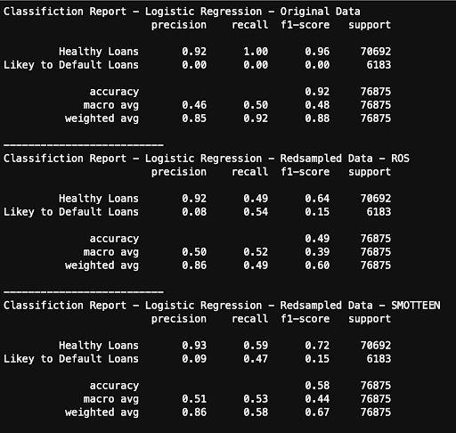
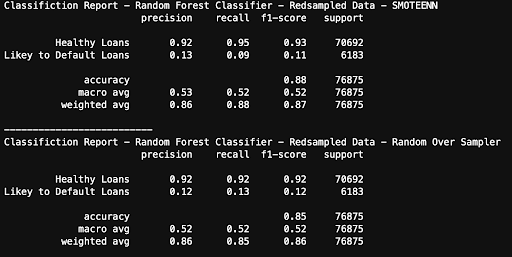

# Classification Model

We built a Classification model that can detect if a loan is likely to default based on a number of input features . 

Since our Data is is labeled, We stuck to Supervised Machine Learning Models 

In total, we build 3 different model and compared their and tested them using balanced data. 

# Data

Originally , The data set from Kaggle contained with 125 features and 300K columns. The posed Hardware issues when running the raw data. After evaluating some of the features , we were able to keep what we thought was the most relevant features. Ultimately this reduced our features from 125 to 11. 

This may impact the accuracy of our models .

# Imbalanced Data 

The issue with our Data is that the number of Healthy loans outweigh the number of Default loans causing a large Imbalance in out data. We used 3 different Data Scaling methods on our models to balance the data set. 

* RandomOverSampler
* SMOTE-ENN (Synthetic Minority Over-sampling Technique - Edited Nearest Neighbor)- Replaced Central Clustroids . 
* Standard Scaler 

One Hot encoder was used to encode our categorical Variables. We combined the numerical and encoded Data Frames for out Training and Test Data Sets.

### Logistic Regression - Classification Report

### Random Forest - Classification Report 

# Summary 

Random Forest Classifier is the better model to keep improving.
This could be largely due to its Ensemble Method of combining Multiple Decision Trees which is quite good for this data set since a lot of factors go into determining if a loan is likely to default or not. 

A way to further improve the model is to revisit the removed features and group certain features into one variable such as income range.

XGBoost would also be a great data sampeling method not used to have the model focus on its mistakes and give better predictions. 

----------------------------------------------------------------------------------------------------------

# Presentation:
https://docs.google.com/presentation/d/1LtQe-u_1z7vdbRfI9t3v6zy0mwx0zS0FTXAJl0sK4HQ/edit?usp=sharing
